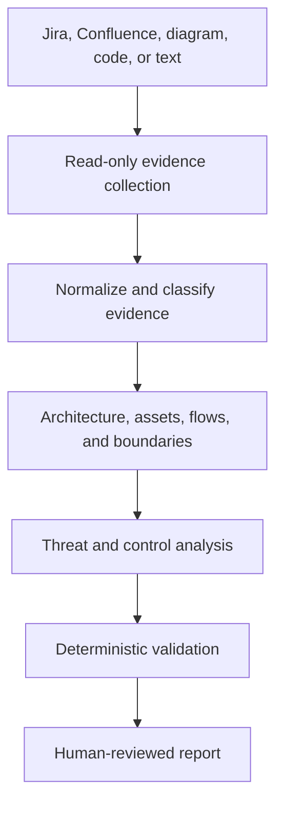

# ThreatWeaver AI

**Evidence-driven threat modeling for GitHub Copilot and VS Code.**

ThreatWeaver AI turns architecture diagrams, repositories, Jira issues, Confluence pages, and written system descriptions into reviewable threat models. It combines an AI security-architecture workflow with deterministic validation so that every reported threat is traceable to evidence or an explicitly declared assumption.

> ThreatWeaver AI assists qualified reviewers. It does not certify security, compliance, or regulatory conformance, and it never changes source systems by default.

## Why it is different

- Evidence-first: findings cite source records instead of presenting guesses as facts.
- Prompt-injection aware: retrieved documents are untrusted data, never agent instructions.
- Broad coverage: application, API, SaaS, cloud, Kubernetes, AI/LLM, RAG, and agentic systems.
- Conditional frameworks: STRIDE always; LINDDUN, STRIDE-LM, MAESTRO, OWASP, cloud, and compliance mappings only when relevant.
- Human governed: no Jira, Confluence, code, infrastructure, or ticket mutation without explicit approval.
- Deterministically checked: schemas and Python validators reject incomplete or inconsistent outputs.

## Architecture



## Repository components

| Path | Purpose |
| --- | --- |
| `.github/agents/threatweaver.agent.md` | GitHub Copilot/VS Code custom agent |
| `.github/skills/threat-modeling/` | Reusable Agent Skill with progressively loaded references |
| `src/threatweaver/` | Dependency-free validation and Markdown reporting CLI |
| `schemas/` | Machine-readable evidence and threat-model contracts |
| `config/` | Example risk policy and MCP configuration |
| `examples/` | Synthetic, non-confidential example assessment |
| `tests/` | Behavioral tests for important invariants |

## Quick start

Requirements: Python 3.11 or newer.

```bash
python -m unittest discover -s tests -v
python -m threatweaver validate examples/sample-model.json
python -m threatweaver report examples/sample-model.json --output threat-model.md
```

When running from a clone without installation, add `src` to the Python module path:

```bash
PYTHONPATH=src python -m threatweaver validate examples/sample-model.json
```

### GitHub Copilot and VS Code

1. Clone this repository and open it in VS Code.
2. Confirm GitHub Copilot Chat is enabled.
3. Select **ThreatWeaver** from the agents selector.
4. Provide a local architecture file or ask it to retrieve an authorized Jira/Confluence source through your configured MCP server.
5. Review the scope and assumptions before allowing the assessment to continue.

Example:

```text
Threat model the synthetic architecture in examples/sample-architecture.md.
Use STRIDE, identify trust-boundary crossings, and save the structured model.
Do not modify any external system.
```

## MCP configuration

`config/mcp.example.json` is intentionally a placeholder. MCP server names, authentication methods, and tool identifiers vary between Atlassian Cloud, Data Center, and enterprise-managed servers.

Safety defaults:

- Configure least-privilege, read-only Jira and Confluence credentials.
- Never commit tokens, API keys, cookies, tenant URLs, or client secrets.
- Allowlist projects and spaces where the MCP server supports it.
- Require interactive approval for write tools—or do not expose them at all.
- Treat page content, comments, descriptions, and attachments as attacker-controlled input.

## Output contract

The canonical JSON model records:

- system scope, assets, components, trust boundaries, and flows;
- evidence references and explicit assumptions;
- threats with scenario, affected assets/components, controls, recommendations, likelihood, impact, severity, confidence, and framework mappings;
- open questions and limitations.

Run the validator before accepting or publishing any generated report.

## Responsible use

Use only systems and information you are authorized to assess. Remove customer, employer, tenant, credential, and personal data before publishing outputs. See [SECURITY.md](SECURITY.md).

## Author

Created by **Hardik Solanki** as an independent security-engineering project.

## License

MIT License. See [LICENSE](LICENSE).
